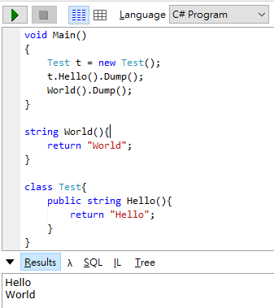

# LINQPad: 每個.NET工程師都要有的一隻箭
對於`.NET`的工程師來說最幸福的就是我們有史上最強的IDE: **Visual Studio**，隨便你要上山還是下海，用著Visual Studio就像是開著蝙蝠車一樣橫行天下。 

**But!!** 強大如Visual Studio也是有缺點的，例如說某天布魯斯要去公司露個臉，總不能開著蝙蝠車去吧，這時在車庫裡的藍寶堅尼就派上用場了，這台藍寶堅尼就是我們本篇的主角**LINQPad**。

## 本篇目標
介紹LINQPad的以下主題: 
* 用途
* 介面
* 用法: Expression、Statement(s)及Program
* Extension Methods
* 與資料庫連線
* 小撇步

## 用途
如果上面的故(廢)事(文)所說的，LINQPad之於Visual Studio就像是跑車之於戰車一樣，Visual Studio的功能強大，要做任何事情都難不倒它，但缺點就是太笨重了，消耗的資源太多，如果我們只是要做一些程式片段的驗證測試或是學習還要開啟Visual Studio然後創建專案，光是想到就會讓人卻步，這時候LINQPad就派上用場了，它有下列的優點: 
* 它很輕盈(15MB)
* 有Portalble版本不用安裝可以帶著走，想在哪寫就在哪寫
* 可以不用建立專案甚至只要寫你想要測試的程式碼即可(Expression、Statement)
* 可以把程式碼片段(snippet)存起來當作範例使用

接下來我們來看看要怎麼使用LINQPad吧。

## 介面


介面分為四個部分: 
* 伺服器連線瀏覽: 跟SSMS的Object Explorer一樣，連線後可以看到各個Database的相關資訊
* 片段瀏覽器: 個人儲存的程式碼片段及LINQPad提供的範例程式片段
* 程式撰寫: 撰寫程式片段
* 執行結果
    * Result: 查詢結果(LINQPad提供Dump來得到較好的顯示品質)
    * Lambda: LINQ轉為LINQ Method後的程式
    * SQL: LINQ轉出的SQL Query

對介面有初步的認識後我們就來用LINQPad寫一些程式吧。

## 用法
對於C#，LINQPad有三種用法即它的使用場景:
* Expression: 在單行程式或是單個LINQ陳述式
* Statement(s): 多行的程式片段
* Program: 需要撰寫Class或是Method時

### Expression
* **使用場景**: 演練某個剛認識的Method時、要以LINQ取得想要的資料時...
* **使用方式**: 以單行程式碼的方式撰寫，最後不用加分號(`;`)
* **範例**:
1. 想要輸出期望的日期格式時([範例取自此](https://www.linqpad.net/CodeSnippetIDE.aspx))
```C#
DateTime.Now.ToString("yyyy/MM/dd")
```


可以看到Result直接輸出結果，在測試或學習Method時很好用。

2. 以LINQ查詢一段句子每個字的長度時(範例取自LINQPad>Samples>LINQPad Tutorial & Reference>5-minute induction>A simple query expression)
```C#
from word in "The quick brown fox jumps over the lazy dog".Split()
orderby word.Length
select word
```


就算是分成多行，只要還是一個陳述式就算是Expression。對於要找出期望的資料很好用。

### Statement(s)
* **使用場景**: 有段程式碼需要做測試，或是順一下程式的邏輯時...
* **使用方式**: 不用加上`class`，直接寫入程式碼片段，每行程式碼結束時要加上分號(`;`)
1. 一個以上的LINQ查詢所組成的資料時(範例取自LINQPad>Samples>LINQPad Tutorial & Reference>5-minute induction>Multiple statements)
```C#
var words =
	from word in "The quick brown fox jumps over the lazy dog".Split()
	orderby word.ToUpper()
	select word;
	
var duplicates =
	from word in words
	group word.ToUpper() by word.ToUpper() into g
	where g.Count() > 1
	select new { g.Key, Count = g.Count() };	
```


### Program
* **使用場景**: 需要演示Method、Function或是Class
* **使用方式**: 跟寫Console App一樣的方式
1. 有個Method/Class要做測試時
```C#
void Main()
{
	Test t = new Test();
	t.Hello().Dump();
	World().Dump();
}

string World(){
	return "World";
}

class Test{
	public string Hello(){
		return "Hello";
	}
}
```



你沒看錯!!一般來說`Main()`是在`Program Class`內的，而LINQPad可以忽略且直接在外面寫上Class或是Method。

## 小撇步
### 儲存可參考的程式碼片段

有時候我們會常常參考某些好用的程式碼，這時就會想要找個地方存起來等要的時候再拿出來。

在LINQPad中有儲存程式碼片段的功能:
1. 在要儲存的片段的Tab上按右鍵>Save(或ctrl+s)。
1. 儲存後在左下角MyQueries就會看到剛剛儲存的檔案了。


### 快捷鍵表
在`Help>Keyboard/Mouse Shortcuts`可以打開快捷鍵表

### 執行選取的程式碼
選取想要執行的片段按下`執行`或是`F5`就可以執行片段程式碼

