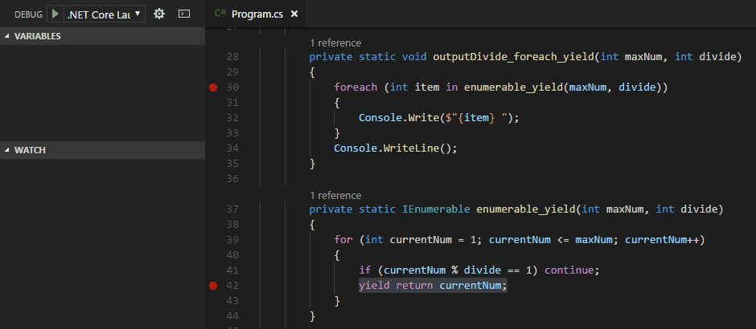

# 仔細體會`yield`的甜美: `yield`介紹
記得以前在學校學寫程式時是寫C語言，那時候認為寫程式要自己實作Linked List等的資料結構是理所當然的事情，就安分守己的自己實作，也沒有多想什麼。

但是自從我開始寫C#後，遇到資料結構的問題都不是去查怎麼實作了，而是去翻**Microsoft Docs**看有沒有可以套用的物件...，C#的方便帶來了很多好處(上手簡單、開發時間縮短...等)，就好像進到了糖果屋一樣，想要吃什麼糖果([語法糖](https://zh.wikipedia.org/wiki/%E8%AF%AD%E6%B3%95%E7%B3%96))都應有盡有，不怕你吃就怕你不吃，我自己就是很愛吃糖的其中一位。

但今天我們要當個探險家，到屋外探索`yield`的起源。

## 進化的程式碼
在這節中我們會看到程式碼也是會**進化**的，總而言之先來個例子吧: **在1到特定數字中輸出可以被某數整除的數列**，來看看下面的程式碼: 

```C#
private static void outputDivide_for(int maxNum, int divide)
{
    for (int currentNum = 1; currentNum <= maxNum; currentNum++)
    {
        if (currentNum % divide != 0) continue;
        Console.Write($"{currentNum} ");
    }
    Console.WriteLine();
}
```

我們用了一個`for`做完了所有的事情，很棒，但試著想想以下的情境: 
* 顯示方式要改成每行一個數字: 

```C#
for (int currentNum = 1; currentNum <= maxNum; currentNum++)
{
    if (currentNum % divide != 0) continue;
    //Console.Write($"{currentNum} ");
    Console.WriteLine($"{currentNum} ");
}
Console.WriteLine();
```

* 計算邏輯修改成: 在1到特定數字中輸出可以被**某數的2倍**整除的數列: 

```C# 
int divideMultitwo = divide * 2;
for (int currentNum = 1; currentNum <= maxNum; currentNum++)
{
    //if (currentNum % divide != 0) continue;
    if (currentNum % divideMultitwo != 0) continue;
    //Console.Write($"{currentNum} ");
    Console.WriteLine($"{currentNum} ");
}
Console.WriteLine();
```

注意到問題了嗎?我們在改變顯示方式及運算邏輯時都動到了這段程式碼，違反了[Single responsibility principle](https://en.wikipedia.org/wiki/Single_responsibility_principle)。

既然這樣，那先取得運算後的陣列存入`List`中，再用迴圈去顯示總可以了吧: 

```C#
private static void outputDivide_foreach_List(int maxNum, int divide)
{
    foreach (int item in enumerable_List(maxNum, divide))
    {
        Console.Write($"{item} ");
    }
    Console.WriteLine();
}

private static IEnumerable enumerable_List(int maxNum, int divide)
{
    List<int> result = new List<int>();

    for (int currentNum = 1; currentNum <= maxNum; currentNum++)
    {
        if (currentNum % divide != 0) continue;
        result.Add(currentNum);
    }
    return result;
}
```

上面這樣寫的確符合了**SRP**，但我們再回頭想想，發現這裡還是埋了一顆炸彈: **效能問題**，請對程式碼做以下的調整: 

* `outputDivide_for`改成下面這樣，直接`break`
```C#
private static void outputDivide_for(int maxNum, int divide)
{
    for (int currentNum = 1; currentNum <= maxNum; currentNum++)
    {
        break;
    }
}
```

* `outputDivide_foreach_List`也一樣，直接`break`
```C#
private static void outputDivide_foreach_List(int maxNum, int divide)
{
    foreach (int item in enumerable_List(maxNum, divide))
    {
        break;
    }
}
```


各位應該猜到問題點了: 不管有沒有需要，`enumerable_List`裡的迴圈都會跑完，並且將取得的數值放到List中，這樣就算我們沒有實際使用到List，也一樣要耗費時間跟空間，相較之下原本的`for`反而沒有這個問題。

可是難道一定要**效能**跟**可維護性**做二選一嗎?在這個例子是不需要的，我們只要用上一章所講的**Iterator Pattern**就可以輕易地解決: 

```C#
private static IEnumerable enumerable_Iterator(int maxNum, int divide)
{
    integersAggregate enumerable = new integersAggregate(maxNum, divide);
    return enumerable;
}

private class integersAggregate : IEnumerable
{
    private int _maxNum;
    private int _divide;

    public integersAggregate(int maxNum, int divide)
    {
        _maxNum = maxNum;
        _divide = divide;
    }

    public IEnumerator GetEnumerator()
    {
        return new integersInterator(_maxNum, _divide);
    }
}
private class integersInterator : IEnumerator
{
    private int _maxNum;
    private int _divide;
    private int currentNum = 1;

    public integersInterator(int maxNum, int divide)
    {
        _maxNum = maxNum;
        _divide = divide;
    }

    public object Current { get; private set; }
    
    public bool MoveNext()
    {
        do
        {
            if (currentNum % _divide == 0)
            {
                Current = currentNum;
                return true;
            }
            currentNum++;
        } while (currentNum <= _maxNum);
        return false;
    }
    
    public void Reset()
    {
        currentNum = 1;
    }
}
```

`foreach`跟`IEnumerable`搭配，每次都是叫用`MoveNext`來確定是否有下一個元素，如果有則將下一個元素值賦予`Current`變數，所以每次只會取得下一個元素，也不會增加額外的空間消費。

使用這樣的方式解決了我們擔心的兩個問題
* 可以保證計算的花費一定值得(效能問題解決)
* 可以將巡覽及計算邏輯拆分(可維護性提高)

但人天生就是懶惰，難道每次愈到巡覽的需求都要實作`IEnumerator`嗎?沒有辦法像宣告`List`那樣簡單明瞭了嗎?

**有的**，就是我們今天的主角`yield`。

## yield
一樣是上一節的例子，但我們改用`yield`來實作`IEnumerable`: 

```C#
private static IEnumerable enumerable_yield(int maxNum, int divide)
{
    for (int currentNum = 1; currentNum <= maxNum; currentNum++)
    {
        if (currentNum % divide != 0) continue;
        yield return currentNum;
    }
}
```

就這樣?對，真的只要這樣就可以做到`Iterator Pattern`做的事情，但寫法卻跟`List`一樣簡單(如果要驗證可以使用解譯器，文末的參考也有些是以解譯後的程式做解釋的，有興趣可以去看看)。

這邊有幾個重點: 
* 如果一個區塊(block)中有`yield`陳述式，此區塊就叫做**Iterator Block**
* 一個方法的區塊如果是**Iterator Block**，則它的回傳值會是`IEnumerable`、`IEnumerator`。

### 運作方式
我們可以將中斷點下在`yield return`那行，然後一步一步執行看看會發生什麼事情，你會發現他跳回`foreach`中，又再跳回`yield block`中:



這個執行順序顛覆了我們對程式的認知，一般的程式都會是迴圈完成後再回傳，而**Iterator Block**卻是遇到了`yield return`就回傳而且執行完`foreach`的**embedded_statement**後還能回到迴圈中繼續執行。

現在試著把**Iterator Block**想成是`Iterator`中的`MoveNext()`，再去看執行順序就比較容易看得懂了。

`foreach`觸發`MoveNext()`時: 可以想成是去執行**Iterator Block**內的程式碼，執行到`yield return`時它做了三件事情:
* **Iterator Block**的執行暫停
* 將`Current`更新成`yield return`的value
* `MoveNext()`回傳true

而`foreach`在執行完**embedded_statement**後再次觸發`MoveNext()`時會從原本暫停的地方再執行下去直到**Iterator Block**中的程式:
* 再次觸發`yield return`
* 執行結束
* `yield break`

這點可以用下面這個例子說明: 

```C#
private static IEnumerable enumerable_yield2()
{
    yield return 1;
    yield return 2;
    yield return 3;
    yield return 4;
    yield return 5;
    yield return 6;
    yield return 7;
    yield return 8;
    yield return 9;
    yield break;
    yield return 10;

    //1 2 3 4 5 6 7 8 9
}
```


其中`yield break`就是停止整個巡覽的動作，所以數列只會印到9而已。

PS: 本節可以搭配上一篇介紹的`foreach`來做學習，會比較好懂。

### 為什麼叫做`yield`
依照[C# 語言規格-類別](https://docs.microsoft.com/zh-tw/dotnet/csharp/language-reference/language-specification/classes#iterators)定義，`Yield Type`代表`Iterator`的回傳資料型態，所以`yield`就是`Iterator`的回傳資料。


## 結語
說到這裡我們的旅程也告一段落了，今天用比較的方式了解`yield`的原貌，`for`到`List`再到`yield`，我們的開發過程也越來越輕鬆，但在使用這些**語法糖**時，也不要忽略了它們背後的意義，因為這往往是它們最有價值的部分。

## 範例程式
[GitHub](https://github.com/peterhpchen/DigDeeperLINQ/tree/develop/demo/05_yield)

## 參考
* [C# spec-statements#the-yield-statement](https://docs.microsoft.com/zh-tw/dotnet/csharp/language-reference/language-specification/statements#the-yield-statement)
* [C# spec-statements#blocks](https://docs.microsoft.com/zh-tw/dotnet/csharp/language-reference/language-specification/statements#blocks)
* [C# spec-classes#iterators](https://docs.microsoft.com/zh-tw/dotnet/csharp/language-reference/language-specification/classes#iterators)
* [安德魯的部落格-[C#: yield return] #1. How It Work ?](http://columns.chicken-house.net/2008/09/18/c-yield-return-1-how-it-work/)
* [stackoverflow-Proper use of 'yield return'](https://stackoverflow.com/a/410058)
* [限量ㄟ蓋步-C# - yeild return 使用方法](http://limitedcode.blogspot.tw/2014/07/c-yeild.html)
* [Microsoft Docs-yield](https://docs.microsoft.com/zh-tw/dotnet/csharp/language-reference/keywords/yield)
* [Kenneth Truyers-Yield return in C#](https://www.kenneth-truyers.net/2016/05/12/yield-return-in-c/)
* [C# in Depth-Iterator Block Implementation](http://csharpindepth.com/Articles/Chapter6/IteratorBlockImplementation.aspx)
