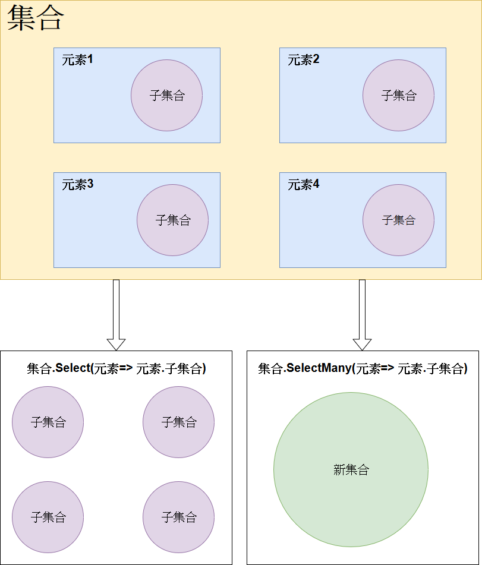

# SelectMany的應用
這次我們要來說一個跟`Select`相似的語法-`SelectMany`，這個語法在處理**Master/Details**(主檔/明細檔)的資料時非常的有用，在沒有`SelectMany`前，我們處理有明細的資料都需要用複數層迴圈才能查找資料，現在我們只要用`SelectMany`就搞定了。

## 功能說明
`SelectMany`可以將集合中每個元素內的子集合合併為一個新的集合。

舉個例子，我們有一個下面這樣子的資料: 
```C#
class 元素
{
    public List<string> 子集合 { get; set; }
}

元素[] 集合=
{
    new 元素() { 子集合 = new List<string>() { "a", "b", "c" } },
    new 元素() { 子集合 = new List<string>() { "d", "e", "f" } },
    new 元素() { 子集合 = new List<string>() { "g", "h", "i" } },
    new 元素() { 子集合 = new List<string>() { "j", "k", "l" } }
};
```
下圖顯示執行`SelectMany`及`Select`的差異: 



各別執行`Select`及`SelectMany`後會變成下面這樣，可以注意兩個**回傳型別**的不同之處: 
```C#
IEnumerable<List<string>> afterSelect = 集合.Select(元素 => 元素.子集合);

IEnumerable<string> afterSelect = 集合.SelectMany(元素 => 元素.子集合);
```

* Select: 將資料經由`Selector`轉換後放入`IEnumerable`中，其**結果的數量跟原本相同**
* SelectMany: `SelectMany`會將`Selector`的結果扁平化，輸出在同一集合中，其**結果的數量會跟原本的不同**

## 方法定義
`SelectMany`有兩組方法，首先來看只有一個`Selector`的方法: 
```C#
public static IEnumerable<TResult> SelectMany<TSource, TResult>(
    this IEnumerable<TSource> source, 
    Func<TSource, IEnumerable<TResult>> selector);

public static IEnumerable<TResult> SelectMany<TSource, TResult>(
    this IEnumerable<TSource> source, 
    Func<TSource, int, IEnumerable<TResult>> selector);
```
* 這兩個多載的差異點跟`Select`一樣都是`selector`多了一個`int`的傳入參數，這個`int`就是每個元素的`index`
* 跟`Select`的不同之處在於`SelectMany`的`selector`的回傳值是一個帶有`TResult`型別元素的`IEnumerable`
* 雖然`Selector`吐回來的型別是`IEnumerable<TResult>`，可是回傳值依然是`IEnumerable<TResult>`，由此我們可以知道`SelectMany`有做扁平化的處理。

另外`SelectMany`還有兩個`Selector`的方法: 
```C#
public static IEnumerable<TResult> SelectMany<TSource, TCollection, TResult>(
    this IEnumerable<TSource> source, 
    Func<TSource, IEnumerable<TCollection>> collectionSelector, 
    Func<TSource, TCollection, TResult> resultSelector);

public static IEnumerable<TResult> SelectMany<TSource, TCollection, TResult>(
    this IEnumerable<TSource> source, 
    Func<TSource, int, IEnumerable<TCollection>> collectionSelector, 
    Func<TSource, TCollection, TResult> resultSelector);
```
* 這兩個方法的差別依然在多個`index`的傳入參數
* 這組方法跟上組方法的差異在於多了一個多了一個`resultSelector`，它可以傳入`TSource`(原本集合的每一個元素)及`TCollection`(子集合中的每一個元素)，讓我們可以讓主檔的資料跟明細的資料合為同一筆資料。

## 查詢運算式
在查詢運算式中並**沒有**`SelectMany`這個`Expression`，但是依照[C# spec](https://docs.microsoft.com/zh-tw/dotnet/csharp/language-reference/language-specification/expressions#query-expressions)我們可以知道依然有`Expression`會轉換為`SelectMany`，請看下面的運算式: 
```C#
from x1 in e1
from x2 in e2
select v
```
當有**複數**個`from`時會轉為下面這樣的運算子: 
```C#
( e1 ) . SelectMany( x1 => e2 , ( x1 , x2 ) => v )
```

當`from`後面不是接`select`時: 
```C#
from x1 in e1
from x2 in e2
...
```

會轉為下面這樣將`from`取得的兩組資料都回傳:
```C# 
from * in ( e1 ) . SelectMany( x1 => e2 , ( x1 , x2 ) => new { x1 , x2 } )
...
```

## 方法範例
下面是一個**商店的物件**: 
```C#
class Store
{
    public string Name { get; set; }
    public string[] Products { get; set; }
}
```

**資料**如下，有兩間商店*App Store*跟*Google Store*: 
```C#
Store[] stores = new Store[] 
{
    new Store()
    {
        Name = "App Store",
        Products = new string[] {"iPhone 8", "iPhone 8s", "iPhone X"}
    },
    new Store()
    {
        Name = "Google Store",
        Products = new string[] {"Pixel", "Pixel 2"}
    }
};
```

我們會用上述的資料做演練。

### 比較Select及SelectMany
* 範例程式
```C#
IEnumerable<string[]> selectQuery = stores.Select(store => store.Products);

IEnumerable<string> selectManyQuery = stores.SelectMany(store => store.Products);
// 等同於下面的Query Expression
//
// from store in stores
// from product in store.Products
// select product

Console.WriteLine("**Select**");
Console.WriteLine();

// Select要兩次迴圈
foreach (string[] products in selectQuery)
{
    foreach (string product in products)
    {
        Console.WriteLine(product);
    }
    Console.WriteLine();
}

Console.WriteLine("**SelectMany**");
Console.WriteLine();

// SelectMany一次迴圈
foreach (string product in selectManyQuery)
{
    Console.WriteLine(product);
}
Console.WriteLine();
```

* 執行結果
```
**Select**

iPhone 8
iPhone 8s
iPhone X

Pixel
Pixel 2

**SelectMany**

iPhone 8
iPhone 8s
iPhone X
Pixel
Pixel 2
```

這裡可以看到`Select`的結果並沒有打平，可是`SelectMany`有，我們可以用`SelectMany`輕易的處理像`store`這樣的**Master/Details**(主檔/明細檔)結構。

### `SelectMany`的第二個`Selector`
* 範例程式
```C#
var selectMany = stores.SelectMany(
    store => store.Products, 
    (store, product) => new { StoreName = store.Name, ProductName = product });

foreach(var product in selectMany){
    Console.WriteLine($"Store Name: {product.StoreName}, Product Name: {product.ProductName}");
}
```

* 執行結果
```
Store Name: App Store, Product Name: iPhone 8
Store Name: App Store, Product Name: iPhone 8s
Store Name: App Store, Product Name: iPhone X
Store Name: Google Store, Product Name: Pixel
Store Name: Google Store, Product Name: Pixel 2
```

注意到了嗎? 我們把主檔及明細的資料合併變成一筆新的資料，所以第二個`resultSelector`的應用就是你可以利用主檔及明細的資料組成你想要的資料。

## 特別之處
### 多個`from`的查詢運算式
在上面的介紹中我們知道`SelectMany`在查詢運算式中是用多個`from`來表示，那如果超過三個會怎麼樣呢? 例如像下面這樣: 
```C#
from store in stores
from product in store.Products
from c in product
select c;
```

我們來想想剛剛講的運算式定義，當最後接的不是`select`時會是下面這樣的型式: 
```C#
from x1 in e1
from x2 in e2
...
```

轉譯為下面這樣: 
```C#
from * in ( e1 ) . SelectMany( x1 => e2 , ( x1 , x2 ) => new { x1 , x2 } )
...
```

那我們就按照位置把上面的範例填入，會變下面這樣: 
```C#
from * in ( stores ) . SelectMany( store => store.Products , ( store , product ) => new { store , product } )
from c in product
select c
```
* \*(星號)可以想成是編譯器取的別名

現在變回兩個`from`，那就依照原本的定義: 
```C#
from x1 in e1
from x2 in e2
select v
```
轉為下面這樣: 
```C#
( e1 ) . SelectMany( x1 => e2 , ( x1 , x2 ) => v )
```
把範例填上去: 
```C#
( ( stores ) . SelectMany( store => store.Products , ( store , product ) => new { store , product } ) ) . SelectMany( * => product, (*, c) => c)
```

終於答案揭曉: 它會跑兩次`SelectMany`，範例結果會是`Product`因為在被做了一次`SelectMany`而被分割為**字母**。

### 第二個`from`的後面接的跟第一個`from`無關
前面的範例在第二個`from`都很乖的用了第一個`from`的屬性，那如果我偏不放第一個`from`的屬性呢? 例如說像下面這樣: 
```C#
string[] PCs = new string[] { "ASUS", "ACER", "DELL" };

var query = from store in stores
            from PC in PCs
            select PC;
```
結果如下: 
```
ASUS
ACER
DELL
ASUS
ACER
DELL
```
它會跑兩次第二個`from`得到的資料，為什麼? 我們來依照定義將對應的變數放上去: 
```C#
( stores ) . SelectMany( store => PCs , ( store , PC ) => PC )
```
* PCs是外部變數，Lambda運算式可以吃到外部變數

有點難懂對吧? 那我們在對照方法定義來觀察: 
```C#
public static IEnumerable<TResult> SelectMany<TSource, TCollection, TResult>(
    this IEnumerable<TSource> source, 
    Func<TSource, IEnumerable<TCollection>> collectionSelector, 
    Func<TSource, TCollection, TResult> resultSelector);
```

重點是在`collectionSelector`，我們可以看到每個`TSource`會輸出一次`IEnumerable<TCollection>`，啊哈，我有**兩間**(*App Store*、*Google Store*)商店阿，所以`PCs`的資料會被重複輸出。

## 結語
SelectMany在物件的資料處理中很常會需要使用，在看到**Master/Details**(主檔/明細檔)時就先想想它吧。

## 範例程式
[GitHub](https://github.com/peterhpchen/DigDeeperLINQ/tree/12_HowToUseSelectMany/demo/12_HowToUseSelectMany)

## 參考
* [C# Spec-expressions#query-expressions](https://docs.microsoft.com/zh-tw/dotnet/csharp/language-reference/language-specification/expressions#query-expressions)
* [Microsoft Docs-SelectMany](https://docs.microsoft.com/zh-tw/dotnet/api/system.linq.enumerable.selectmany?view=netframework-4.7.1)
* [Microsoft Docs-projection-operations](https://docs.microsoft.com/zh-tw/dotnet/csharp/programming-guide/concepts/linq/projection-operations)
* [draw.io](https://www.draw.io/)