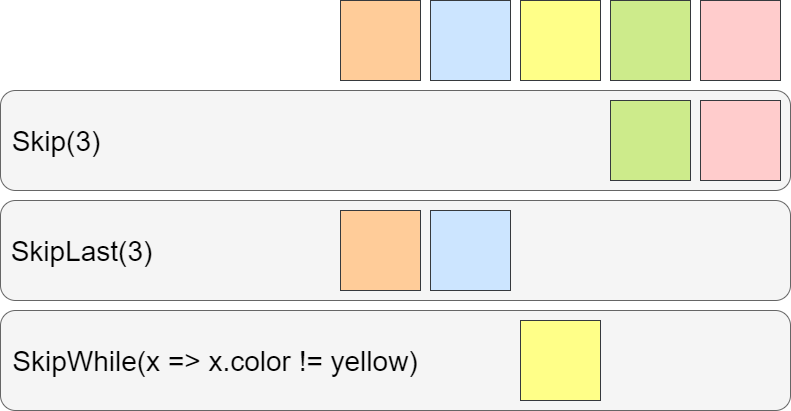

# Skip的應用

今天要說的方法是`Skip`，就是可以**忽略部分元素**的方法，我們在處理資料時可能會有某些資料不想要輸出的需求，這時就可以用`Skip`來達成，現在我們來看看`Skip`要怎麼使用。

## 功能說明

設定要忽略的元素數量(`Skip`、`SkipLast`)或是條件(`SkipWhile`)，回傳的集合就不會包含其忽略的元素。

## 方法定義

`Skip`有三種不同名稱的方法: `Skip`、`SkipLast`、`SkipWhile`，它們的差別可以用下圖來說明:



我們看圖說故事:

* `Skip`: 由集合的第一個元素開始記數，到達指定的數量為止的元素都忽略不算在結果集合中
* `SkipLast`: 由集合的最後個元素往前記數，到達指定的數量為止的元素都忽略不算在結果集合中
* `SkipWhile`: 集合中符合條件的元素忽略，其餘的元素傳回結果集合中

看完上面的例子應該會比較清楚三個`Skip`的差別，接著我們依序來看方法定義。

### Skip

```C#
public static IEnumerable<TSource> Skip<TSource>(
    this IEnumerable<TSource> source,
    int count);
```

* `count`: 要忽略的元素數量

`Skip`是回傳忽略**第1個**到第`count`個元素的集合。

### SkipLast

```C#
public static IEnumerable<TSource> SkipLast<TSource>(
    this IEnumerable<TSource> source,
    int count);
```

* `count`: 要忽略的元素數量

`SkipLast`是回傳忽略**最後1個**元素數來`count`個元素的集合。

### SkipWhile

```C#
public static IEnumerable<TSource> SkipWhile<TSource>(
    this IEnumerable<TSource> source,
    Func<TSource, bool> predicate);

public static IEnumerable<TSource> SkipWhile<TSource>(
    this IEnumerable<TSource> source,
    Func<TSource, int, bool> predicate);
```

* `predicate`: 判斷式，如果符合判斷是傳回`true`的話則忽略此元素，反之`false`的話則保留
* 第二個方法`predicate`多傳入`index`參數為元素的**位置**

`SkipWhile`是回傳**不符合**`predicate`條件的元素集合。

## 方法範例

### 顏色

> 依照上面的圖片的範例寫成方法

```C#
string[] color = new string[] { "Orange", "Blue", "Yellow", "Green", "Pink" };

IEnumerable<string> skipResults = color.Skip(3);
IEnumerable<string> skipLastResults = color.SkipLast(3);
IEnumerable<string> skipWhileResults = color.SkipWhile(x => x != "Yellow");

Dictionary<string, IEnumerable<string>> results = new Dictionary<string,IEnumerable<string>>(){
    { "Skip", skipResults },
    { "SkipLast", skipLastResults },
    { "SkipWhile", skipWhileResults }
};

string output = "";
foreach (KeyValuePair<string, IEnumerable<string>> keyValue in results)
{
    output += $"{keyValue.Key}: ";
    foreach (string c in keyValue.Value)
    {
        output += $"{c},";
    }
    output = output.Trim(',') + '\n';
}
Console.WriteLine(output);
```

輸出結果如下:

```C#
/*
 * Skip: Green,Pink
 * SkipLast: Orange,Blue
 * SkipWhile: Yellow,Green,Pink
 */
```

## 特別之處

* 有**延遲執行**的特性，在`GetEnumerator()`或是`foreach`叫用後才會執行
* **沒有查詢運算式**
* `Skip`或`SkipLast`指定的`count`數量**大於**集合數量，則傳回**空**集合
* `Skip`或`SkipLast`指定的`count`數量**小於等於**零，則傳回**完整**的集合
* `SkipWhile`的`predicate`對所有元素都傳回`true`，則回傳**空**集合

## 範例程式

* [GitHub](https://github.com/peterhpchen/DigDeeperLINQ/tree/master/demo/24_HowToUseSkip)

## 參考

* [Microsoft Docs-Linq Partitioning Data](https://docs.microsoft.com/zh-tw/dotnet/csharp/programming-guide/concepts/linq/partitioning-data)
* [Microsoft Docs-Linq Skip](https://docs.microsoft.com/zh-tw/dotnet/api/system.linq.enumerable.skip?view=netframework-4.7.1)
* [Microsoft Docs-Linq SkipWhile](https://docs.microsoft.com/zh-tw/dotnet/api/system.linq.enumerable.skipwhile?view=netframework-4.7.1)