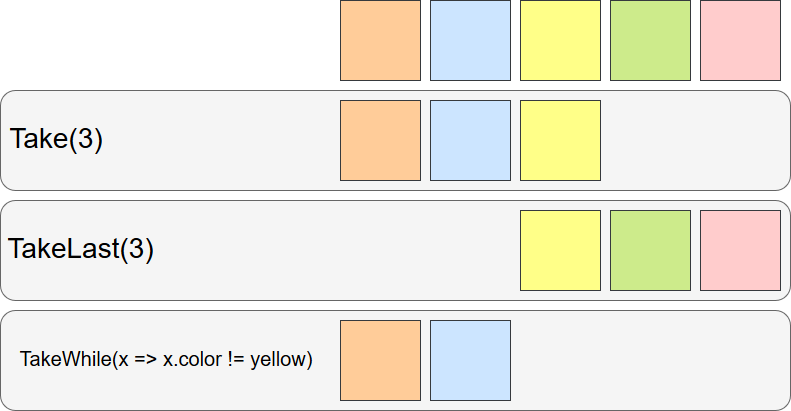

# Take的應用

前面的`Skip`方法是在目標集合上做忽略元素的處理，這次要說的`Take`是跟`Skip`完全相反的方法，`Take`是做選取元素的處理，接下來我們來看看`Take`的使用方式。

## 功能說明

設定資料來源要選取的元素數或是條件後取得目標元素集合。

## 方法定義

跟`Skip`相同，`Take`也有三個不同名稱的方法: `Take`、`TakeLast`、`TakeWhile`，現在依序來看他們的定義:

三個方法的比較圖如下:



* `Take`: 第一個元素起算到參數設定的數量為止的元素的集合為結果集合
* `TakeLast`: 最後個元素往前算到參數設定的數量為止的元素集合為結果集合
* `TakeWhile`: 第一個元素開始取直到不符合條件的元素為止，結果集合為第一個元素到不符合條件的元素的前一個元素元素的集合

上面簡述了三個Take方法的元素取法，下面我們繼續介紹個別的方法定義。

### Take

```C#
public static IEnumerable<TSource> Take<TSource>(
    this IEnumerable<TSource> source,
    int count);
```

* `count`: 由第一個開始選取的元素數量

`Take`是由**第一個**元素選取`count`個元素的**集合**。

### TakeLast

```C#
public static IEnumerable<TSource> TakeLast<TSource>(
    this IEnumerable<TSource> source,
    int count);
```

* `count`: 由最後一個往前選取的元素數量

`TakeLast`是由**最後個**元素**往前**選取`count`個元素的**集合**。

### TakeWhile

`TakeWhile`有**兩個**公開方法，差別在`predicate`有沒有傳入`index`參數

```C#
public static IEnumerable<TSource> TakeWhile<TSource>(
    this IEnumerable<TSource> source,
    Func<TSource, bool> predicate);

public static IEnumerable<TSource> TakeWhile<TSource>(
    this IEnumerable<TSource> source,
    Func<TSource, int, bool> predicate);
```

* `predicate`: 選取的條件，一旦碰到傳回`false`的元素，此元素(包含)後的所有元素都會被忽略

`TakeWhile`是由`predicate`判斷式來決定選取的元素，如果元素讓`predicate`傳回`false`，這個元素後的所有元素都會被忽略。

## 方法範例

### 顏色

> 以上圖的例子實作範例

```C#
string[] color = new string[] { "Orange", "Blue", "Yellow", "Green", "Pink" };

IEnumerable<string> skipResults = color.Take(3);
IEnumerable<string> skipLastResults = color.TakeLast(3);
IEnumerable<string> skipWhileResults = color.TakeWhile(x => x != "Yellow");

Dictionary<string, IEnumerable<string>> results = new Dictionary<string, IEnumerable<string>>(){
    { "Skip", skipResults },
    { "SkipLast", skipLastResults },
    { "SkipWhile", skipWhileResults }
};

string output = "";
foreach (KeyValuePair<string, IEnumerable<string>> keyValue in results)
{
    output += $"{keyValue.Key}: ";
    foreach (string c in keyValue.Value)
    {
        output += $"{c},";
    }
    output = output.Trim(',') + '\n';
}
Console.WriteLine(output);
```

輸出結果如下:

```C#
/*
 * Take: Orange,Blue,Yellow
 * TakeLast: Yellow,Green,Pink
 * TakeWhile: Orange,Blue
 */
```

## 特別之處

* 有**延遲執行**的特性，使用`foreach`或是叫用`GetEnumerator()`時才會對資料做處理
* **沒有查詢運算式**
* `Take`或`TakeLast`指定的`count`數量**大於集合數量**，則傳回**完整的集合**
* `Take`或`TakeLast`指定的`count`數量**小於等於零**，則傳回**空的集合**
* `Take`跟`Skip`是**互補**的，以相同的條件叫用`Skip`(`SkipLast`、`SkipWhile`)跟`Take`(`TakeLast`、`TakeWhile`)，兩個結果合在一起的元素集合會是原本的集合

## 結語

這次說的`Take`跟`Skip`在很多方面是相同的，因這兩個方法互補，所以說明起來會跟Skip很相似，之後的原碼探索應該也會是這樣，我們到時再來瞧瞧。

## 範例程式

* [GitHub]()

## 參考

* [Microsoft Docs-依據執行方式將標準查詢運算子分類](https://docs.microsoft.com/zh-hk/dotnet/csharp/programming-guide/concepts/linq/classification-of-standard-query-operators-by-manner-of-execution)
* [Microsoft Docs-分割資料](https://docs.microsoft.com/zh-hk/dotnet/csharp/programming-guide/concepts/linq/partitioning-data)
* [Microsoft Docs-Enumerable.Take](https://docs.microsoft.com/zh-hk/dotnet/api/system.linq.enumerable.take?view=netframework-4.7.1)
* [Microsoft Docs-Enumerable.TakeWhile](https://docs.microsoft.com/zh-hk/dotnet/api/system.linq.enumerable.takewhile?view=netframework-4.7.1)